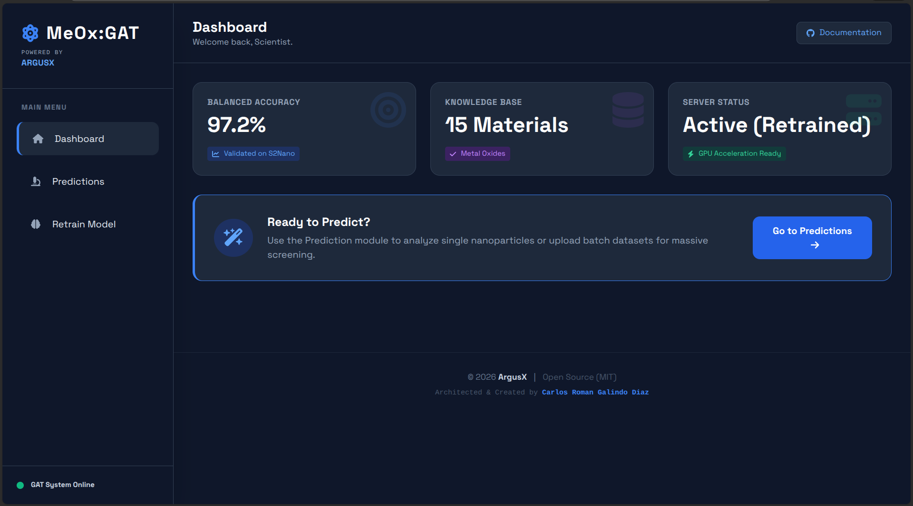
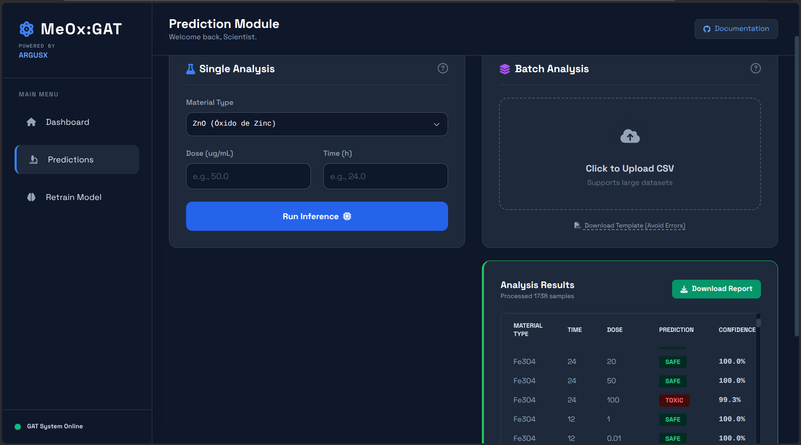

# 🧬 MeOx: AI Nanotoxicity Prediction Platform 


> **A high-performance MLOps platform for *in-silico* nanotoxicity screening, powered by Graph Attention Networks (GAT).**

---

## Academic Background & Origin

This project was originally designed, developed, and implemented as the core component of my **Master's Thesis** in **Computo Aplicado CUCEI**.

The primary objective was to bridge the gap between **Computational Chemistry** and **Production-Grade Software Engineering**. MeOx demonstrates that complex graph-based deep learning models can be deployed in secure, scalable, and user-friendly industrial environments, democratizing access to AI tools for researchers without coding expertise.

---

## Key Features

### Artificial Intelligence Core (GAT)
- Utilizes **Graph Attention Networks (GAT)** to learn complex relationships between exposure dose, time, and material properties.
- Trained and validated on **15 distinct metal oxides**, including:
  > Al₂O₃, CeO₂, CoO, CuO, Fe₂O₃, Gd₂O₃, HfO₂, In₂O₃, La₂O₃, Mn₂O₃, NiO, Sb₂O₃, SiO₂, TiO₂, and ZnO.
- **Balanced Accuracy:** >97.2% on test datasets.

### High-Performance Batch Processing
- **Asynchronous Pipeline:** Capable of processing massive datasets (10,000+ rows) without blocking the server or freezing the UI.
- **Smart Cancellation:** Features a secure interrupt system. Users can instantly cancel heavy batch jobs without corrupting server memory or leaving zombie processes.
- **Reactive Interface:** Dashboard built with optimized Vanilla JS and TailwindCSS (Dark Mode), designed for instant loading and zero-latency feedback.

### Enterprise-Grade Security
- **Strict Validation:** Implements Pydantic schemas to prevent logical errors (e.g., negative doses, invalid timeframes).
- **Anti-DoS Protection:** Enforces file size limits (10MB) and extension verification to prevent "compression bomb" attacks or malicious file injections.
- **Containerization:** Fully isolated execution environment via Docker.

### MLOps & Lifecycle
- **Live Retraining:** Integrated module to ingest new data and update GAT model weights directly from the dashboard.
- **Real-Time Metrics:** Dynamic visualization of system status and model accuracy.

---

## Tech Stack

* **Backend:** Python 3.13.5, FastAPI, Uvicorn (Asynchronous Server).
* **Machine Learning:** PyTorch, DGL (Deep Graph Library), Scikit-learn, Pandas.
* **Frontend:** HTML5, JavaScript (ES6+), TailwindCSS.
* **Infrastructure:** Docker, Docker Compose.
* **Version Control:** Git, DVC (Data Version Control).

---

## 📸 Screenshots

| Main Dashboard | Batch Analysis Results |
|:---:|:---:|
|  |  |
> *Interface optimized for high-performance scientific visualization.*

---

## Installation & Deployment

### Option A: Docker (Recommended)

The fastest way to deploy the full system.

```bash
# 1. Clone the repository
git clone [https://github.com/carlosrgdot/MeOx_Docker_Edition)
cd MeOx

# 2. Build the image
docker build -t meox-platform .

# 3. Run the container
docker run -p 8000:8000 meox-platform

### Option B: Local Execution

# 1. Create a virtual environment
python -m venv .venv
source .venv/bin/activate  # Windows: .venv\Scripts\activate

# 2. Install dependencies
pip install -r requirements.txt

# 3. Start the server
python app.py
